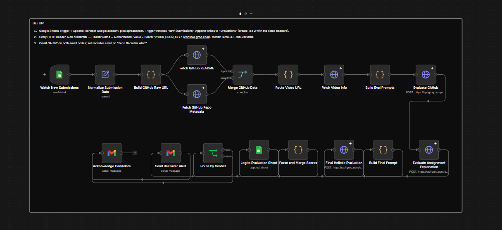
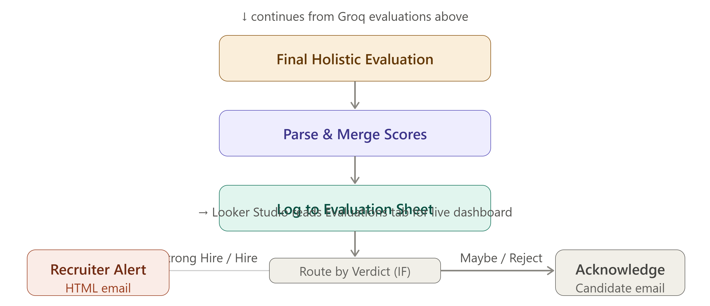

# AI-Candidate-Evaluation-Pipeline
# 🤖 AI-Powered Candidate Evaluation Pipeline

> Automatically evaluates hiring assignment submissions using n8n, Groq AI, and Google Sheets — zero manual review required.

Built as part of the **Eubrics Automation Engineer Internship** assignment. This pipeline processes candidate submissions end-to-end: from a public Google Form through AI scoring to a recruiter dashboard and email alerts.

---

## 📸 Workflow Screenshot

> *The complete n8n canvas showing all 17 nodes — from Google Sheets Trigger through Groq AI evaluation to Gmail alerts.*

---

## 🏗️ Architecture

---

## 🛠️ Tech Stack

| Tool | Category | Cost |
|---|---|---|
| **n8n** | Workflow automation engine | Free tier |
| **Google Form** | Candidate intake — public submission form | Free |
| **Google Sheets** | Storage — raw submissions + scored results | Free |
| **Groq API (Llama 3 70B)** | AI evaluation engine — 3 sequential calls | Free — 14,400 req/day |
| **GitHub REST API** | Repo metadata — stars, language, topics | Free — 60 req/hr |
| **raw.githubusercontent.com** | README content extraction | Free |
| **YouTube oEmbed API** | Video title + description | Free, no key needed |
| **Loom oEmbed API** | Video title + description | Free, no key needed |
| **Gmail OAuth2** | Recruiter alerts + candidate emails | Free |
| **Looker Studio** | Live recruiter dashboard | Free |

**Total infrastructure cost: $0**

---

## ⚡ Quick Start

### Prerequisites
- Google account
- n8n account — [n8n.io](https://n8n.io)
- Groq API key (free) — [console.groq.com](https://console.groq.com)

### 1 — Create the Google Form

Go to [forms.google.com](https://forms.google.com) and add these fields:

| Field | Type | Required |
|---|---|---|
| Full Name | Short answer | ✅ |
| Email | Short answer | ✅ |
| College / Company | Short answer | ✅ |
| GitHub Repository URL | Short answer | ✅ |
| Loom / YouTube Demo Video URL | Short answer | ✅ |
| Google Drive Link for Resume PDF | Short answer | ❌ |
| Project Documentation URL | Short answer | ❌ |
| Assignment Explanation (200 words max) | Paragraph | ✅ |

**Responses → Link to Sheets → Create new spreadsheet** → name it `Eubrics Candidate Evaluations`

### 2 — Set Up the Evaluations Tab

In the spreadsheet, add Tab 2 named `Evaluations`. Paste this into cell **A1**:

### 3 — Add Groq Credential in n8n

**Settings → Credentials → Add → HTTP Header Auth**

### 4 — Import the Workflow

1. Open n8n → New Workflow
2. Click **⋯ → Import from file**
3. Upload `n8n/workflow_export.json`
4. Connect credentials to each node
5. Set Spreadsheet ID in both Sheets nodes
6. Replace `RECRUITER_EMAIL_HERE` in the alert node
7. Toggle workflow to **Active**

### 5 — Test

Submit a test Google Form entry. Within 5 minutes:
- [ ] n8n Executions tab shows a green run
- [ ] New scored row in Evaluations tab
- [ ] Recruiter alert email received (if score ≥ 6.5)
- [ ] Candidate acknowledgement received

See [`docs/TESTING.md`](docs/TESTING.md) for full test scenarios and debugging.

---

## 📊 Scoring Framework

### 9 Evaluation Dimensions

| Dimension | What It Measures |
|---|---|
| **GitHub Score** | README quality, code structure, documentation, completeness |
| **Communication Score** | Clarity, professionalism, written expression |
| **Technical Score** | Depth of understanding, correct terminology |
| **Innovation Score** | Originality, creative problem-solving |
| **Architecture Score** | System thinking, design decisions |
| **Automation Thinking Score** | n8n understanding, workflow design sense |
| **Business Value Score** | Practical usefulness of the solution |
| **Video Score** | Explanation quality, confidence, demo clarity |
| **Overall Score** | Weighted holistic score across all dimensions |

### Verdict Classification

| Verdict | Meaning | Action |
|---|---|---|
| 🌟 **Strong Hire** | Top candidate | Interview immediately |
| ✅ **Hire** | Good candidate | Schedule interview |
| 🤔 **Maybe** | Borderline | Manual review |
| ❌ **Reject** | Does not meet bar | Archive |

---

## 🔄 How the n8n Workflow Works

### Intake (why Google Form, not email)

Recruiters typically receive unstructured emails — every candidate formats them differently. Google Form enforces structure at submission time. Each submission auto-populates a Sheet row. n8n polls that row every 5 minutes. **Zero email parsing. Zero manual work.**

### Why Three Groq AI Calls

| Call | Focus | Output |
|---|---|---|
| **Call 1** | GitHub only | readme_quality, code_structure, automation_relevance, innovation |
| **Call 2** | Communication only | communication_score, clarity, technical_depth, video_score |
| **Call 3** | Synthesiser | overall_score, verdict, strengths, weaknesses, hiring_summary |

One large combined prompt produces worse scores (attention dilution). Three focused calls are also easier to debug — if GitHub scores are wrong, you know exactly which prompt to fix.

### Failure Handling

Every external HTTP call has `continueOnFail: true`. Missing README, private repo, or bad video URL — the pipeline always completes. The `safeParseJson` code node strips markdown backticks and wraps `JSON.parse` in try/catch so a malformed Groq response never crashes the workflow.

---

---

## 📬 Recruiter Outputs

### Email Alert (Strong Hire / Hire)
Sent immediately with full HTML score table, top strengths, weaknesses, summary, and interview focus areas.

### Candidate Acknowledgement
Sent to every candidate confirming receipt of their submission.

### Looker Studio Dashboard
Connect at [lookerstudio.google.com](https://lookerstudio.google.com) → Add data → Google Sheets → Evaluations tab.

Recommended charts: Total Applications scorecard · Average Score scorecard · Verdict pie chart · Candidate rankings table · Score trend line chart · College distribution bar chart

---

## 🔧 Extending the Pipeline

| What to Add | How |
|---|---|
| Resume PDF analysis | Google Drive export node + 4th Groq call |
| Slack notifications | Add Slack node after Gmail alert |
| Instant trigger (vs 5-min poll) | Google Apps Script webhook on the Sheet |
| Different AI model | Swap `llama3-70b-8192` in the 3 HTTP Request nodes |
| More score dimensions | Extend prompts in `/evaluation/` + add columns to Sheet |

---

## 📄 License

MIT — use freely, attribution appreciated.

---

*Built by [Farah Ali] · Eubrics Automation Engineer Internship Assignment*
